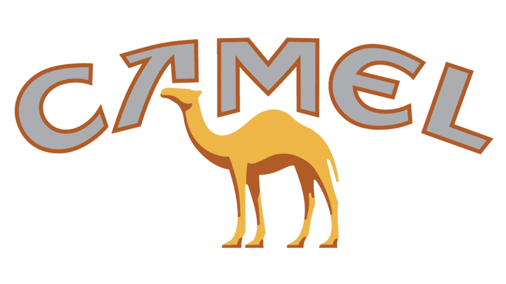
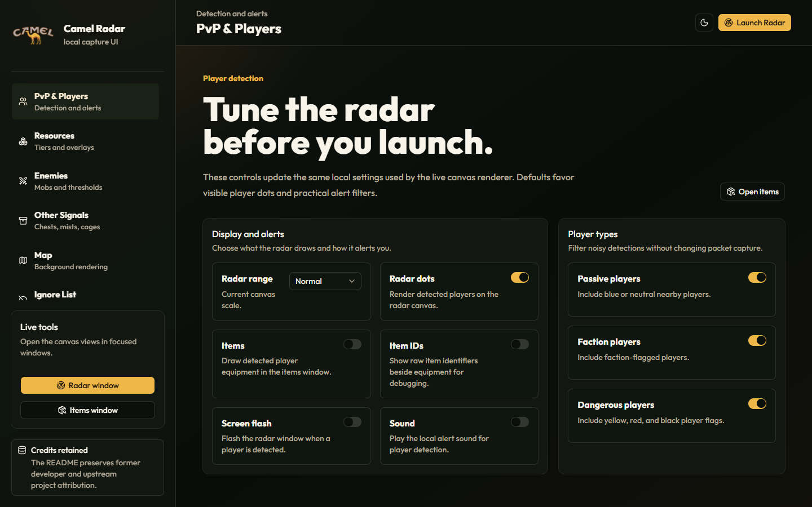
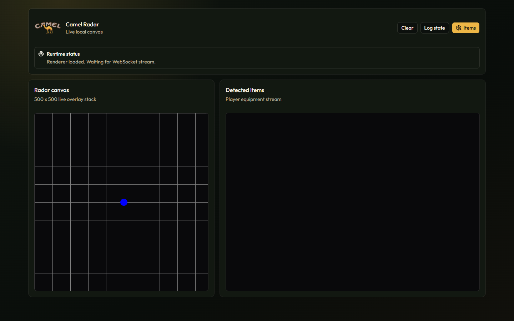

<div align="center">



# Albion Radar — Camel Radar for Albion Online

### Free, open-source **Albion Online radar** and map overlay. See nearby players, gatherable resources, enemies, chests, dungeons, and mists in real time.

Language: **English** | [Bahasa Indonesia](README.id.md)

[](LICENSE)
[](#requirements)
[](https://nodejs.org)
[](#tech-stack)
[](CONTRIBUTING.md)
[](https://github.com/fizakbrr/Albion-Radar/stargazers)

</div>

**Camel Radar** is a free, open-source **Albion Radar** for **Albion Online** — a local radar overlay and map tool that reads your own network traffic to show nearby players, gathering resources, mobs, enemies, chests, dungeons, fishing spots, and mist objectives in a clean browser-based UI. It runs entirely on your PC with passive packet capture (no injection, no memory reading, no third-party servers), and can also run in a no-capture demo mode for UI testing.

If you have been searching for an **Albion Online radar**, an **Albion gathering radar**, or an **Albion player radar** that is open source, actively maintained, and easy for non-technical players to install, this project is built for you.

> ⭐ **If this Albion radar is useful, please [star the repository](https://github.com/fizakbrr/Albion-Radar) — it helps other Albion Online players find it.**

---

## Screenshots

| Radar settings & filters | Live radar canvas |
| --- | --- |
|  |  |

---

## Table of Contents

- [Why Camel Radar](#why-camel-radar)
- [Getting Started (No Coding Needed)](#getting-started-no-coding-needed)
- [Key Features](#key-features)
- [How It Works](#how-it-works)
- [Requirements](#requirements)
- [Installation](#installation)
- [Usage](#usage)
- [Configuration](#configuration)
- [FAQ](#faq-albion-radar)
- [Comparison with Other Albion Radars](#comparison-with-other-albion-radars)
- [Troubleshooting](#troubleshooting)
- [Contributing](#contributing)
- [Disclaimer](#disclaimer)
- [Credits](#credits)
- [License](#license)

---

## Why Camel Radar

- **Truly open source** — read every line of the packet parser and radar logic. No obfuscated binaries.
- **Passive & local** — captures your own UDP traffic on port `5056`. No game-client injection, no memory editing, no data leaves your machine.
- **Modern UI** — React + Tailwind interface instead of a cramped legacy overlay, with per-resource, per-tier, and per-enchant filters.
- **Beginner-friendly** — a step-by-step, no-coding setup guide plus double-click Windows scripts.
- **Actively maintained** — regular fixes, tests, and a clean TypeScript build pipeline.

## Getting Started (No Coding Needed)

This section is for players who just want to run this Albion Online radar while they play — no programming knowledge required. Follow the steps below in order. Each one only needs to be done once, except where noted.

### What you'll need

- A Windows 10 or 11 PC (the same PC you play Albion Online on).
- An internet connection.
- About 10 minutes for the first-time setup.

### Step 1 — Install Node.js

Node.js is the free program that lets Camel Radar run on your computer.

1. Go to [nodejs.org](https://nodejs.org) and download the **LTS** version (the button labeled
   "Recommended for Most Users").
2. Open the downloaded file and click **Next** through the installer using the default options.
3. Restart your computer once the install finishes.

### Step 2 — Download Camel Radar

1. Go to the [Camel Radar GitHub page](https://github.com/fizakbrr/Albion-Radar).
2. Click the green **Code** button, then click **Download ZIP**.
3. Find the downloaded ZIP file (usually in your `Downloads` folder), right-click it, and choose
   **Extract All...**. Pick a folder you'll remember, like your Desktop.

### Step 3 — Install Npcap (only needed to see live players/resources)

Camel Radar reads Albion Online's network traffic to show things on the radar. Npcap is the free
tool that lets it do that.

1. Go to [npcap.com/#download](https://npcap.com/#download) and download the Npcap installer.
2. Run the installer. When you reach the options screen, make sure **"Install Npcap in WinPcap
   API-compatible Mode"** is checked, then finish the install.

If you skip this step, Camel Radar will still open in your browser, but the radar will stay empty
since it can't read any game data.

### Step 4 — Install Camel Radar's components

1. Open the folder where you extracted Camel Radar.
2. Open the `bin` folder inside it.
3. Double-click **`install.bat`**.
4. A black window will open and show text scrolling by — this is normal, it's downloading
   everything Camel Radar needs. Wait until it says "Press any key to continue" and press any key
   to close it.

You only need to do this step once (or again later if you download a newer version of Camel Radar).

### Step 5 — Run Camel Radar

1. Go back to the `bin` folder.
2. Right-click **`start.bat`** and choose **Run as administrator** (Administrator access is needed
   so Camel Radar is allowed to read the game's network traffic).
3. The first time you run it, the black window will list your network connections with numbers next
   to them, like:
   ```text
   1. Wi-Fi          ip address: 192.168.1.25
   2. Ethernet        ip address: 192.168.1.30
   ```
   Type the number for the connection you use to play Albion Online (usually the only one with
   internet access) and press Enter. Camel Radar remembers your choice, so you won't be asked again.
4. Your web browser should open automatically to the Camel Radar page. Leave the black window open
   in the background — closing it stops Camel Radar.
5. Launch Albion Online and log in. The radar will start showing map data as you play.

### Every time after that

You don't need to repeat Steps 1–4. Just do **Step 5** again: right-click `start.bat` in the `bin`
folder and choose **Run as administrator**.

### Stopping Camel Radar

Close the browser tab, then close the black window (or click inside it and press `Ctrl+C`).

### If something doesn't work

- **Windows shows a blue "Windows protected your PC" screen** when installing Node.js or Npcap —
  this is normal for smaller, independent installers. Click **More info**, then **Run anyway**.
- **The radar page opens but stays empty** — Albion Online might not be running yet, or the wrong
  network connection was chosen in Step 5. Open the `bin` folder's parent folder, delete the file
  named `ip.txt` if you see one, and run `start.bat` again to choose the connection once more.
- **A firewall pop-up appears the first time you run it** — click **Allow access** so Camel Radar
  can talk to itself over your local network.
- **You want to try the interface without live game data** — open the Camel Radar folder (not the
  `bin` folder), and open a PowerShell window there (Shift + right-click inside the folder, then
  choose "Open PowerShell window here"), and run:
  ```powershell
  npm run start:no-capture
  ```

If you're comfortable with a terminal or want more control (custom ports, environment variables,
running tests, etc.), see the [Installation](#installation) and [Usage](#usage) sections below,
which cover the same setup using command-line steps instead of the helper scripts.

## Key Features

- **Albion Online player radar** — see nearby players with faction/flag coloring and optional alerts.
- **Albion gathering radar** — living and static resource overlays for fiber, hide, wood, ore, and rock, filterable by tier (T1–T8) and enchant (0–4).
- **Enemy & mob radar** — mobs, mini-bosses, bosses, mist bosses, drones, and event enemies with a minimum-health filter.
- **Chest, dungeon, fishing, and mist objective handlers** for full map awareness.
- Player list and equipment display when compatible data is available.
- Local **Express HTTP server with WebSocket streaming** for real-time updates.
- Modern **React, Vite, Tailwind CSS**, and shadcn-style UI components.
- Optional **passive packet capture** through Npcap and the native `cap` package — no injection.
- **No-capture mode** for development, demos, and UI testing without live Albion Online traffic.
- TypeScript build pipeline for the frontend, runtime scripts, server, and tests.

## How It Works

Camel Radar listens passively to the **Photon** UDP traffic (port `5056`) that Albion Online already
sends and receives on your own machine. It parses those packets locally (Protocol 16 and Protocol 18),
turns recognized events into map, player, resource, and objective data, and streams that to a local
browser UI over WebSocket. Nothing is injected into the game, no memory is read, and no data is sent
to any external server — the entire radar runs on `localhost`.

## Tech Stack

- TypeScript
- React
- Vite
- Tailwind CSS
- shadcn UI components
- Express
- WebSocket
- Node.js
- Npcap and `cap` for optional local packet capture
- Node test runner

## Requirements

- Windows 10/11
- Node.js `20.20.2` or newer
- npm `10.8.0` or newer

For live packet capture only:

- Npcap installed
- Visual Studio C++ build tools
- Administrator terminal
- Albion Online traffic on UDP port `5056`

The React UI, static routes, WebSocket tests, and parser fixture tests can run without packet capture.

## Installation

```powershell
git clone https://github.com/fizakbrr/Albion-Radar.git
cd Albion-Radar
npm ci
```

The native `cap` package is optional. If it cannot build on your machine, Camel Radar can still run as an Albion Online utility in no-capture mode.

## Usage

Run the Albion Online overlay UI without packet capture:

```powershell
npm run start:no-capture
```

Open:

```text
http://localhost:5001
```

Run with live local packet capture:

```powershell
npm start
```

On the first live-capture run, choose the network adapter used by Albion Online. The selected adapter IP is saved to `ip.txt`, which is ignored by git.

You can also pass the adapter directly:

```powershell
$env:CAMEL_RADAR_ADAPTER_IP = "192.168.1.25"
npm start
```

## Development Commands

Build the complete project:

```powershell
npm run build
```

Run the compiled Express backend after a build:

```powershell
npm run serve
```

Run the Vite frontend server for frontend iteration:

```powershell
npm run dev
```

Run tests:

```powershell
npm test
```

The test command builds the React frontend, compiles the TypeScript runtime and server, starts the server with capture disabled, verifies key UI/static/config routes, checks WebSocket payload shape, and exercises parser fixture buffers.

Windows helper scripts are available in `bin/`:

- `bin/install.bat`: runs `npm ci`
- `bin/start.bat`: runs `npm start`

## Configuration

Environment variables:

- `PORT`: HTTP UI port, default `5001`
- `WS_PORT`: WebSocket port, default `5002`
- `WS_HOST`: WebSocket host, default `localhost`
- `CAMEL_RADAR_CAPTURE`: `1` to attempt packet capture, `0` to disable it
- `CAMEL_RADAR_ADAPTER_IP`: IPv4 address of the capture adapter
- `CAMEL_RADAR_OPEN_BROWSER`: `1` to open the browser after start, `0` to skip it

Example:

```powershell
$env:PORT = "5101"
$env:WS_PORT = "5102"
$env:CAMEL_RADAR_CAPTURE = "0"
npm run serve
```

## FAQ: Albion Radar

**What is an Albion radar?**
An Albion radar is a tool that shows nearby players, gatherable resources, mobs, and other objects
from Albion Online on a separate map or overlay, giving you more awareness of your surroundings while
gathering, ganking, or avoiding PvP. Camel Radar is a free, open-source Albion Online radar you run
locally on your own PC.

**Is Camel Radar free?**
Yes. Camel Radar is completely free and open source under the ISC License. There is no paid tier,
subscription, or premium build.

**Does the Albion radar inject into the game or read memory?**
No. Camel Radar only passively reads the network traffic your own PC already sends and receives on
UDP port `5056`. It does not inject code into the Albion Online client, read game memory, or modify
any game files.

**Do I need to know how to code to use it?**
No. Follow the [Getting Started (No Coding Needed)](#getting-started-no-coding-needed) guide — it uses
double-click Windows scripts and takes about 10 minutes for first-time setup.

**Which operating systems are supported?**
Live packet capture is built and tested for Windows 10 and 11. The UI itself is browser-based, and the
no-capture demo mode can run anywhere Node.js runs.

**Why is my radar empty?**
The most common causes are that Albion Online isn't running, the wrong network adapter was selected,
or Npcap isn't installed. See [Troubleshooting](#troubleshooting).

**Can I get banned for using an Albion radar?**
Radar tools of this kind are against Albion Online's terms of service, and use is at your own risk.
Camel Radar is provided for educational and research purposes — see the [Disclaimer](#disclaimer).

## Comparison with Other Albion Radars

There are several open-source Albion Online radar projects (for example, ZQRadar, QRadar, and various
DEATHEYE forks). Camel Radar focuses on:

- A **modern React UI** with granular per-resource, per-tier, and per-enchant filters instead of a
  legacy overlay.
- A **beginner-friendly, no-coding setup guide** and double-click Windows scripts.
- A **clean, typed, tested codebase** (TypeScript, Node test runner) that is easy to read, fork, and
  extend.
- **Passive, local-only capture** with no injection and no external servers.

If you maintain another Albion radar and would like a fair, factual comparison entry here, open an
issue or pull request.

## Project Structure

```text
.
|-- server/                   # Express server, WebSocket server, adapter selection, and capture startup
|-- src/                      # React, Vite, Tailwind, and shadcn UI frontend
|-- scripts/
|   |-- Handlers/             # Albion Online entity, resource, map, player, and objective handlers
|   |-- Drawings/             # Canvas drawing helpers for radar and map overlays
|   |-- Utils/                # Runtime settings, event codes, WebSocket config, and browser entrypoints
|   |-- classes/              # Photon packet parser and protocol deserializers
|   `-- enumerations/         # Protocol type mappings
|-- tools/                    # Build-time asset copy utilities
|-- tests/                    # Node test runner coverage for server, WebSocket, parser, and resource data
|-- bin/                      # Optional Windows helper scripts
|-- images/                   # Local image assets used by the UI and overlay runtime
|-- sounds/                   # Audio assets used by radar alerts
|-- config/                   # Local runtime configuration, ignored by git
|-- tsconfig*.json            # TypeScript project configs
`-- package.json              # npm scripts, dependencies, and package metadata
```

Generated build output is written to `dist/`, `dist-runtime/`, `dist-server/`, and `dist-config/`.

## Troubleshooting

### UI starts but live data is empty

Confirm:

- Albion Online is running and connected to the world.
- The adapter IP in `ip.txt` matches the network adapter carrying Albion Online traffic.
- `CAMEL_RADAR_CAPTURE` is not set to `0`.
- No old Node process is occupying `5001` or `5002`.
- Npcap and the native `cap` package are installed correctly.

### Packet capture is unavailable

Use no-capture mode while you fix native dependencies:

```powershell
npm run start:no-capture
```

Then verify the native capture module:

```powershell
node -e "const { Cap } = require('cap'); console.log(Cap.deviceList())"
```

### Radar page opens but shows no player dots

Current Albion Online traffic can omit or protect exact live player coordinates. Camel Radar can still show supported identity, equipment, or entity data when packets are available, but it cannot draw exact dots without usable position data.

### TypeScript errors remain visible in the editor

Run `TypeScript: Restart TS Server` in VS Code. The repository uses separate TypeScript configs for the React app, legacy browser runtime, server runtime, and scripts folder.

## Contributing

Contributions are welcome and directly help this Albion radar improve and rank for more players to
find. See [CONTRIBUTING.md](CONTRIBUTING.md) for how to set up the project, run tests, and open a pull
request. Good first contributions include documentation improvements, new resource/enemy mappings, UI
polish, and bug fixes.

If you just want to help discoverability: **star the repo**, share it with your guild, and link to it
from Albion Online communities, wikis, and forums.

## GitHub Topics

This repository uses the following topics to help players discover it. Suggested topics:

- `albion-radar`
- `albion-online-radar`
- `albion-online`
- `albion-online-tools`
- `albion-online-utility`
- `albion-online-overlay`
- `albion-map-tool`
- `albion-gathering-radar`
- `radar`
- `game-utility`
- `desktop-utility`
- `open-source-game-tool`
- `typescript`
- `react`
- `websocket`
- `express`

## Disclaimer

This project is provided for educational and research purposes only. Using radar or overlay tools may
violate Albion Online's terms of service and can result in penalties, including account bans. Use it
responsibly and at your own risk, and respect the terms of service of any software, platform, or game
it interacts with. The maintainers are not responsible for misuse, account penalties, or violations of
third-party rules.

## Credits

Camel Radar is maintained by fizakbrr.

Original project work by Zeldruck. Additional upstream radar work by FashionFlora, legacy packet parsing work from `photon-packet-parser`, and Protocol 18 behavior cross-checked against AutoDruid's photon parser.

## License

This project is licensed under the ISC License. See the [LICENSE](LICENSE) file and the `license` field in `package.json`.

---

<div align="center">

**Keywords:** Albion Radar · Albion Online Radar · Albion gathering radar · Albion player radar · Albion Online overlay · Albion map tool · free open-source Albion radar

If Camel Radar helped you, please [⭐ star the repository](https://github.com/fizakbrr/Albion-Radar) so more Albion Online players can find it.

</div>
